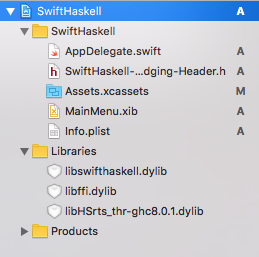
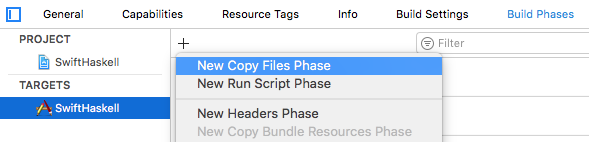
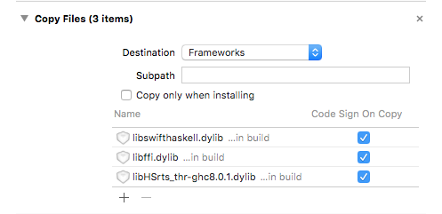

> Write or rewrite a tutorial that covers building a project
> that interfaces haskell backend code with Swift GUI code in an
> XCode 8.2 project. Bonus points if the entire thing can be
> built from the command line `stack build` rather than inside
> XCode.

# Integrating Haskell with Swift Mac Apps

To start, let's create a new Xcode project:

Then `cd` into the directory with the `.xcodeproj` and create a
new stack project:

    $ cd SwiftHaskell
    $ stack new SwiftHaskellLibrary simple-library

Let's move these files up to the top directory, so we can
run both `stack` and `xcodebuild` from the same directory:

    $ mv -vn SwiftHaskellLibrary/* .
    $ rmdir SwiftHaskellLibrary

## Exporting Haskell Functions to Swift

Add a `foreign export` function to the Haskell library.

TODO: Explain exporting using Haskell's C FFI

    module Lib where

    import Foreign.C

    foreign export ccall square :: CInt -> CInt

    square :: CInt -> CInt
    square x = x * x

If we `stack build` now, in addition to building the library,
GHC will generate a C header file for us to include. Because
it's a build artifact, it's buried somewhat deep in the file
hierarchy, but we can ask `stack` where it is:

    $ find "$(stack path --dist-dir)" -name Lib_stub.h
    .stack-work/dist/x86_64-osx/Cabal-1.24.0.0/build/Lib_stub.h

The stub header includes `HsFFI.h` from GHC, so we'll also need
to find the current compiler's version of that header.

    $ find "$(stack path --compiler-bin)/.." -name HsFFI.h
    /Users/nanotech/.stack/programs/x86_64-osx/ghc-8.0.1/bin/../lib/ghc-8.0.1/include/HsFFI.h

Let's make a script to symlink to these from a more convenient
location so we don't need to change the Xcode project when the
compiler or Cabal version changes:

    #!/bin/sh
    set -eux
    DIST_DIR="$(stack path --dist-dir)"
    ln -sf ../"$DIST_DIR"/build/Lib_stub.h build/
    ln -sf "$GHC_LIB_DIR"/include build/

Run it, then add `$(PROJECT_DIR)/build` and
`$(PROJECT_DIR)/build/include` to the target's *User Header
Search Paths* in Xcode:

Now that we have the exported definitions in a header file, we
need to import them into Swift. Create a new header file in
Xcode named `SwiftHaskell-Bridging-Header.h` and save it in the
same directory as `AppDelegate.swift`. Then set it as the
*Objective-C Bridging Header* in Xcode:

And include the Haskell stub header:

    #ifndef SwiftHaskell_Bridging_Header_h
    #define SwiftHaskell_Bridging_Header_h

    #include "Lib_stub.h"

    #endif /* SwiftHaskell_Bridging_Header_h */

## Linking

To link our Haskell library into our Swift app, we'll build it
as a dynamic library and add it to our Xcode project. Building a
static library is also possible, but currently requires
[rebuilding the GHC standard libraries][pic-ghc].

[pic-ghc]: https://github.com/lyokha/nginx-haskell-module#static-linkage-against-basic-haskell-libraries

Add a `ghc-options` line to the `library` section in the
`.cabal` file:

    library
      # ... other options
      ghc-options: -threaded -dynamic -shared -fPIC -o build/libswifthaskell.dylib

- `-threaded` enables the multithreaded GHC runtime, which is
   usually what you want.
- `-dynamic` tells GHC to link to the dynamic versions of
  Haskell libraries. This is required when using `-shared`.
- `-shared` builds a shared library.
- `-fPIC` enables position-independent code, which is needed for
  shared libraries.

Run `stack build`, then drag `build/libswifthaskell.dylib` into
the Xcode project and add it to the SwiftHaskell target.

We'll also need to link to the RTS so we can initialize it
from Swift, and copy all shared library dependencies into the
app bundle so it's self-contained. `otool -L` will show what
libraries `libswifthaskell.dylib` depends on:

    $ otool -L build/libswifthaskell.dylib
    build/libswifthaskell.dylib:
            @rpath/libswifthaskell.dylib (compatibility version 0.0.0, current version 0.0.0)
            @rpath/libHSbase-4.9.0.0-ghc8.0.1.dylib (compatibility version 0.0.0, current version 0.0.0)
            @rpath/libHSinteger-gmp-1.0.0.1-ghc8.0.1.dylib (compatibility version 0.0.0, current version 0.0.0)
            @rpath/libHSghc-prim-0.5.0.0-ghc8.0.1.dylib (compatibility version 0.0.0, current version 0.0.0)
            /usr/lib/libiconv.2.dylib (compatibility version 7.0.0, current version 7.0.0)
            /usr/lib/libSystem.B.dylib (compatibility version 1.0.0, current version 1226.10.1)

Let's update our previous script to locate them and symlink them
into the build directory:

    #!/bin/sh
    set -eux

    DIST_DIR="$(stack path --dist-dir)"
    GHC_VERSION="$(stack exec -- ghc --numeric-version)"
    GHC_LIB_DIR="$(stack path --compiler-bin)/../lib/ghc-$GHC_VERSION"

    ln -sf ../"$DIST_DIR"/build/Lib_stub.h build/
    ln -sf "$GHC_LIB_DIR"/include build/
    ln -sf "$GHC_LIB_DIR"/rts/libHSrts_thr-ghc"$GHC_VERSION".dylib build/
    # FIXME: Link the other Haskell libraries
    ln -sf "$GHC_LIB_DIR"/rts/libffi.dylib build/

This is the `symlink_deps.sh` script in the repository.

TODO: Find shared library dependencies automatically, like
`cabal-macosx`.

Drag these libraries into Xcode too,

Then go to the target's Build Phases panel and add a new phase
to copy the libraries into the app bundle:

## Runtime Setup

Before using functions from Haskell, we'll need to start its
runtime. `hs_init` takes pointers to C's argc and argv, however
since we aren't using command line arguments, we can just pass a
constant array.

Add this to your app delegate's `applicationDidFinishLaunching`
method:

    func applicationDidFinishLaunching(_ aNotification: Notification) {
        var argv0 = Array("SwiftHaskell".utf8CString)
        argv0.withUnsafeMutableBufferPointer { argv0bp in
            var argv = [argv0bp.baseAddress];
            var argc = CInt(argv.count)
            argv.withUnsafeMutableBufferPointer { argvbp in
                var argvp = argvbp.baseAddress
                hs_init(&argc, &argvp)
            }
        }
    }

And the corresponding `hs_exit` to `applicationWillTerminate`:

    func applicationWillTerminate(_ aNotification: Notification) {
        hs_exit()
    }

TODO: Explain swift pointer bits.

## Calling Haskell from Swift

Add a new label to the window in `MainMenu.xib` for us to write
the result of our Haskell function `square` into, and add it as
an `@IBOutlet` to the `AppDelegate`:

    @IBOutlet weak var label: NSTextField!

We already have our Haskell library's header imported, so we
can just call the exported `square` function. Add this to
`applicationDidFinishLaunching`:

    label.stringValue = "\(square(5))"

And run the app:

## Calling Swift from Haskell

TODO: FunPtr callbacks
