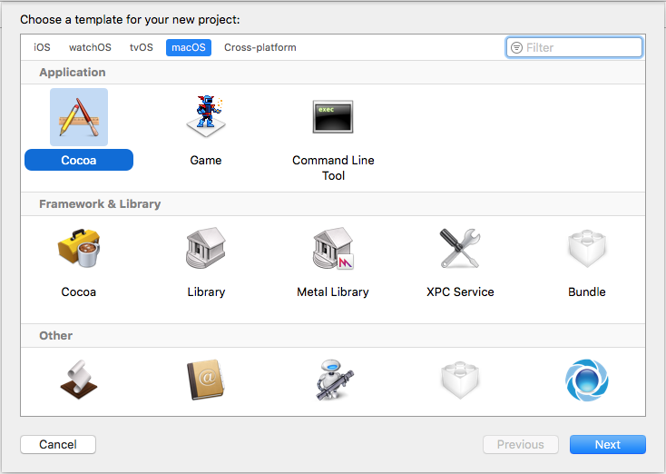
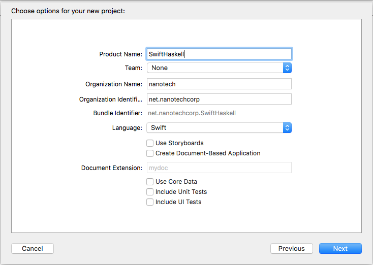
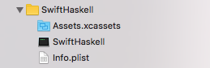
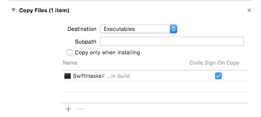
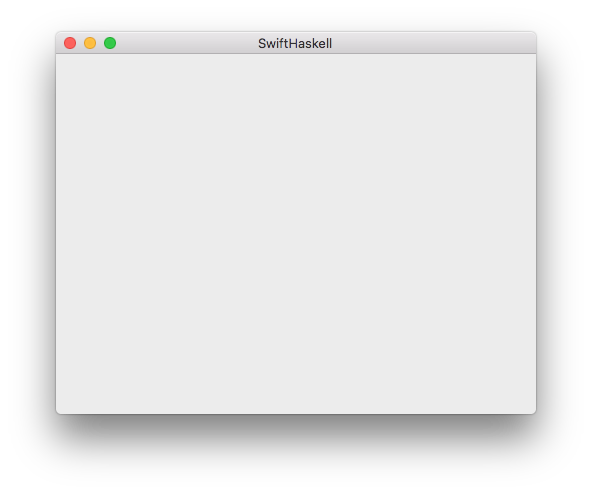
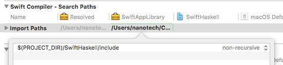
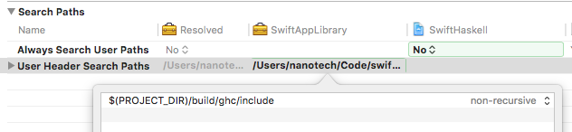
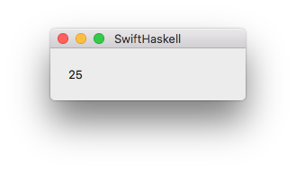

# Integrating Haskell with Swift Mac Apps

To start, create a new Cocoa Application Xcode project
with Swift as the default language:





Then `cd` into the directory with the `.xcodeproj` and create a
new stack project:

```sh
$ cd SwiftHaskell
$ stack new SwiftHaskellLibrary simple
```

Move these files up to the top directory, so we can run all of
our commands from the same directory:

```sh
$ mv -vn SwiftHaskellLibrary/* .
$ rmdir SwiftHaskellLibrary
```

In `SwiftHaskellLibrary.cabal`, rename the executable to
match the Xcode app's name of SwiftHaskell:

```cabal
executable SwiftHaskell
```

To combine our Haskell library with our Swift UI, we'll build
the Swift app as a framework and link to it from the Haskell
executable. Xcode will then package both up into an app bundle.

The reason for doing the linking in this direction is that
building a self-contained dynamic library is currently simpler
with Swift and Xcode than it is with Cabal.

## Exporting Haskell Functions

Here's the trivial function `square` that we'll export as a
simple first example:

```haskell
square x = x * x
```

Haskell functions exported via the FFI can only contain
certain types in their signatures that are compatible with C:
primitive integers, floats and doubles, and pointer types.
The full list is in [section 8.7 of the Haskell
Report][haskell-report-8.7].

Since we'll only be using `square` to demonstrate the FFI, let's
assign it a FFI-compatible type directly. For more complex
functions, wrap them in a new function and convert their inputs
and outputs as needed.

```haskell
import Foreign.C

square :: CInt -> CInt
square x = x * x
```

To export `square`, add a `foreign export` definition with a
calling convention of `ccall`:

```haskell
foreign export ccall square :: CInt -> CInt
```

For the full syntax of `foreign export`, see [section 8.3 of the
Haskell Report][haskell-report-8.3].

[haskell-report-8.7]: https://www.haskell.org/onlinereport/haskell2010/haskellch8.html#x15-1700008.7
[haskell-report-8.3]: https://www.haskell.org/onlinereport/haskell2010/haskellch8.html#x15-1530008.3

Together, `src/Main.hs` is

```haskell
module Main where

import Foreign.C

foreign export ccall square :: CInt -> CInt

square :: CInt -> CInt
square x = x * x

main :: IO ()
main = do
  putStrLn "hello world"
```

## Importing Haskell's Generated FFI Headers into Swift

If we now `stack build`, in addition to building the library,
GHC will generate C header files for each module with foreign
exports. Because these are build artifacts, they're buried
somewhat deep in the file hierarchy, but we can ask `stack`
and `find` where they are:

    $ find "$(stack path --dist-dir)" -name Main_stub.h
    .stack-work/dist/x86_64-osx/Cabal-1.24.0.0/build/SwiftHaskellLibrary/SwiftHaskellLibrary-tmp/Main_stub.h

These stub headers `#include "HsFFI.h"` from GHC, so we'll also
need to find the current compiler's version of that header.

    $ find "$(stack path --compiler-bin)/.." -name HsFFI.h
    /Users/nanotech/.stack/programs/x86_64-osx/ghc-8.0.1/bin/../lib/ghc-8.0.1/include/HsFFI.h

Since we'll be importing these headers into a Swift framework,
we won't be able to use `#include` as we would in C. Instead,
Swift uses [Clang's module format][clang-modules]. (Swift
applications can use [bridging headers][swift-bridging-headers],
but frameworks [must use modules][so-non-modular-header].) A
`module.modulemap` file to import `Main_stub.h` looks like

    module SwiftHaskell {
        header "Main_stub.h"
        export *
    }

[swift-bridging-headers]: https://developer.apple.com/library/content/documentation/Swift/Conceptual/BuildingCocoaApps/MixandMatch.html#//apple_ref/doc/uid/TP40014216-CH10-ID156
[so-non-modular-header]: https://stackoverflow.com/questions/24103169/swift-compiler-error-non-modular-header-inside-framework-module/37072619#37072619
[clang-modules]: http://clang.llvm.org/docs/Modules.html

As the paths to these headers vary, let's use a script to
automatically copy them out and build a module map. We'll also
create a symlink to the built executable's location for later.

```bash
#!/usr/bin/env bash
set -eu

EXECUTABLE_NAME=SwiftHaskell
DIST_DIR="$(stack path --dist-dir)"
GHC_VERSION="$(stack exec -- ghc --numeric-version)"
GHC_LIB_DIR="$(stack path --compiler-bin)/../lib/ghc-$GHC_VERSION"
STUB_BUILD_DIR="${DIST_DIR}/build/${EXECUTABLE_NAME}/${EXECUTABLE_NAME}-tmp"
STUB_MODULE_DIR="${EXECUTABLE_NAME}/include"
STUB_MODULE_MAP="${STUB_MODULE_DIR}/module.modulemap"

# Create a module map from the generated Haskell
# FFI export headers for importing into Swift.
mkdir -p "${STUB_MODULE_DIR}"
NL="
"
module_map="module ${EXECUTABLE_NAME} {${NL}"
for h in $(find "${STUB_BUILD_DIR}" -name '*.h'); do
    h_filename="${h/$STUB_BUILD_DIR\//}"
    cp "$h" "${STUB_MODULE_DIR}/"
    module_map="${module_map}    header \"${h_filename}\"${NL}"
done
module_map="${module_map}    export *${NL}"
module_map="${module_map}}"
echo "${module_map}" > "${STUB_MODULE_MAP}"

# Symlink to the current GHC's header directory from a more
# convenient place for Xcode to find.
mkdir -p build/ghc
ln -sf "${GHC_LIB_DIR}/include" build/ghc/

# Symlink to the Haskell executable for Xcode.
ln -sf "../${DIST_DIR}/build/${EXECUTABLE_NAME}/${EXECUTABLE_NAME}" build/
```

Save the script as `link-deps.sh`, run `stack build`, and then
run `bash link-deps.sh` to prepare for the next section.

## Converting the Swift App to a Framework

Create a new Cocoa Framework target in the Xcode project
named SwiftAppLibrary, then change the Target Membership of
`AppDelegate.swift` and `MainMenu.xib` to only SwiftAppLibrary
in Xcode's File Inspector in the right sidebar:


In the new framework's build settings, set **Always Embed Swift
Standard Libraries** to **Yes**.

Drag the `SwiftHaskell` executable we built previously with
Stack into Xcode from the `build/` directory that we symlinked
it into, but do not add it to any targets when prompted:



In the SwiftHaskell app target's Build Phases, remove the
**Compile Sources** and **Link Binary With Libraries**
phases, and add a new **Copy Files** phase that copies the
`SwiftHaskell` executable into the app bundle's Executables
directory:



Finally, in the SwiftAppLibrary framework target's Build Phases,
add a new **Run Script** phase to create a symlink to the built
framework for us to link to from Cabal:

```sh
set -u
ln -sf "${BUILT_PRODUCTS_DIR}/${FULL_PRODUCT_NAME}" "${PROJECT_DIR}/build/"
```

## Linking to the Framework

Add these options to the executable's section in the `.cabal`
file:

```cabal
executable SwiftHaskell
  ghc-options:         -threaded -framework-path build
  ld-options:          -rpath @executable_path/../Frameworks
  frameworks:          SwiftAppLibrary
```

- `-threaded` enables the multithreaded GHC runtime, which is
   usually what you want.
- `-framework-path build` tells GHC to look for frameworks where we
  symlinked our framework to.
- `-rpath @executable_path/../Frameworks` embeds into the
  executable where the dynamic linker should look for shared
  libraries.

## Starting the GUI

Because Haskell has control over the program's entry point
(`main`), we'll need to have it call out to Cocoa to start its
main thread. In `SwiftAppLibrary.h`, declare a new function
named `runNSApplication` and mark it as `FOUNDATION_EXPORT` to
indicate that it should be exported from the framework:

```c
FOUNDATION_EXPORT void runNSApplication(void);
```

Implement the function by adding a new Objective-C `.m` file to
the framework target containing

```objective-c
#import "SwiftAppLibrary.h"

@interface AClassInThisFramework : NSObject @end
@implementation AClassInThisFramework @end

void runNSApplication(void) {
    NSApplication *app = [NSApplication sharedApplication];
    NSBundle *bundle = [NSBundle bundleForClass:[AClassInThisFramework class]];
    NSArray *topObjects;
    [[[NSNib alloc] initWithNibNamed:@"MainMenu" bundle:bundle]
     instantiateWithOwner:app topLevelObjects:&topObjects];
    [app run];
}
```

This *is* possible to write in Swift, however as of Swift 3.0.2,
the annotation to export unmangled C symbols (`@_cdecl`) is not
documented as stable. Additionally, whole module optimization
will assume that `@_cdecl` symbols are unused and remove them.

In `Main.hs`, import the foreign function and call it from
the end of `main`:

```haskell
module Main where

import Foreign.C

foreign export ccall square :: CInt -> CInt

square :: CInt -> CInt
square x = x * x

foreign import ccall "runNSApplication" runNSApplication :: IO ()

main :: IO ()
main = do
  putStrLn "hello world"
  runNSApplication
```

`runNSApplication` will not return, being busy with Cocoa's
main run loop. Use `Control.Concurrent.forkIO` before calling
`runNSApplication` to run other tasks as needed.

Run `stack build`, and build and run the `SwiftHaskell` app
target in Xcode to launch the app and see the default window
from `MainMenu.xib`:



## Completing Linking Setup

Add `$(PROJECT_DIR)/SwiftHaskell/include` to the framework
target's **Swift Compiler - Search Paths, Import Paths** setting
in Xcode,



and `$(PROJECT_DIR)/build/ghc/include` to the framework's **User
Header Search Paths** setting:



In order for the framework to be able to link to symbols in the
Haskell executable, we need to tell the linker to leave symbols
undefined and have them be resolved at runtime.

Add `-undefined dynamic_lookup` to the framework's **Other
Linker Flags** setting.

Be aware that this means that link errors will occur at runtime
instead of at link time. Also note that the framework linking
to symbols in the executable (and depending on the generated
headers), and the executable linking to the framework, creates
a circular dependency. When initially building the project, you
will need to build the components in this order:

- `stack build` to generate the Haskell FFI export headers.
  Linking will fail, as the Swift framework is not built yet.
- Build the Swift framework.
- `stack build`
- Build the app bundle.

The first step can be skipped subsequently by committing the
generated headers to source control.

To help automate this, add a new **Run Script** build phase to
the beginning of the framework's build phases with the contents

```sh
stack build
bash link-deps.sh
```

Add the Haskell sources as input files:

```
$(PROJECT_DIR)/src/Main.hs
$(PROJECT_DIR)/SwiftHaskellLibrary.cabal
```

And the executable as an output file:

```
$(PROJECT_DIR)/build/SwiftHaskell
```

Or, if you prefer building primarily with `stack build`, set the
`build-type` in your `.cabal` to `Custom` and add a `postBuild`
hook to `Setup.hs`:

```haskell
import Distribution.Simple
import System.Process

main = defaultMainWithHooks $ simpleUserHooks
  { postBuild = \args buildFlags pkgDesc localBuildInfo -> do
      callProcess "bash" ["link-deps.sh"]
      callProcess "xcodebuild" ["-target", "SwiftHaskell"]
  }
```

## Calling Haskell from Swift

We're now ready to use exported Haskell functions from Swift.
Import `SwiftHaskell` at the top of `AppDelegate.swift`

```swift
import SwiftHaskell
```

Add a new label to the window in `MainMenu.xib` for us to write
the result of our Haskell function `square` into, and add it as
an `@IBOutlet` to the `AppDelegate`:

```swift
@IBOutlet weak var label: NSTextField!
```

We already have our Haskell library's header imported, so we
can just call the exported `square` function. Add this to
`applicationDidFinishLaunching`:

```swift
label.stringValue = "\(square(5))"
```

The final contents of `AppDelegate.swift` are:

```swift
import Cocoa
import SwiftHaskell

class AppDelegate: NSObject, NSApplicationDelegate {

    @IBOutlet weak var window: NSWindow!
    @IBOutlet weak var label: NSTextField!

    func applicationDidFinishLaunching(_ aNotification: Notification) {
        label.stringValue = "\(square(5))"
    }

    func applicationWillTerminate(_ aNotification: Notification) {
    }
}
```

Running the app,



## Passing Complex Data Types

### Bytes

#### `[UInt8]` to `ByteString`

Call `withUnsafeBufferPointer` on a Swift `Array` to get
an `UnsafeBufferPointer`, and then read its `.baseAddress`
property to get an `UnsafePointer` pass into the exported
Haskell function. The corresponding mutable variants are
`withUnsafeMutableBufferPointer`, `UnsafeMutableBufferPointer`,
and `UnsafeMutablePointer`.

The generated Haskell headers use a single pointer type for all
pointers, `HsPtr` (`void *`), which is mutable (not `const`). If
you know that a function does not mutate through a pointer, you
can use the `HsPtr(mutating:)` constructor to cast a non-mutable
pointer to a mutable pointer.

```swift
bytes.withUnsafeBufferPointer { bytesBufPtr in
    someHaskellFunction(HsPtr(mutating: bytesBufPtr.baseAddress), bytesBufPtr.count)
}
```

If the function mutates the pointer's data, you must use
`withUnsafeMutableBytes`:

```swift
bytes.withUnsafeMutableBufferPointer { bytesBufPtr in
    someHaskellFunction(bytesBufPtr.baseAddress, bytesBufPtr.count)
}
```

To bring an array of bytes into a Haskell `ByteString`, use
`Data.ByteString.packCStringLen`:

```haskell
type CString = Ptr CChar
packCStringLen :: (CString, Int) -> IO ByteString
```

For example,

```haskell
import Foreign.C
import Foreign.Ptr

import qualified Data.ByteString as B
import Data.Word

foreign export ccall countBytes :: Word8 -> Ptr CChar -> CSize -> IO CSize

countBytes :: Word8 -> Ptr CChar -> CSize -> IO CSize
countBytes needle haystack haystackLen = do
  s <- B.packCStringLen (haystack, fromIntegral haystackLen)
  pure (B.foldl (\count b -> count + if b == needle then 1 else 0) 0 s)
```

With a Swift wrapping function of

```swift
func count(byte: UInt8, in bytes: [UInt8]) -> Int {
    var r = 0
    bytes.withUnsafeBytes { bytesPtr in
        r = Int(SwiftHaskell.countBytes(byte, HsPtr(mutating: bytesPtr.baseAddress)))
    }
    return r
}
```

#### `ByteString` to `[UInt8]`

To pass a `ByteString` to an exported Swift function that
accepts a pointer and a length, use `useAsCStringLen`:

```haskell
import Data.ByteString (ByteString)
import qualified Data.ByteString as B

foreign import ccall "someSwiftFunction" someSwiftFunction :: Ptr CChar -> CSize -> IO ()

passByteString :: ByteString -> IO ()
passByteString s =
  B.useAsCStringLen s $ \(p, n) ->
    someSwiftFunction p (fromIntegral n)
```

To return the contents of a `ByteString`, call `mallocArray` to
allocate a new array with C's `malloc` allocator and copy the
`ByteString` data into it. The Swift caller is then responsible
for calling `free` on the pointer. Use `Foreign.Storable.poke`
to also return the size by writing into a passed pointer.

```haskell
import Data.ByteString (ByteString)
import qualified Data.ByteString as B
import qualified Data.ByteString.Unsafe as BU
import Foreign.Storable (poke)

mallocCopyByteString :: ByteString -> IO (Ptr CChar, Int)
mallocCopyByteString s =
  BU.unsafeUseAsCStringLen s $ \(p, n) -> do
    a <- mallocArray n
    copyArray a p n
    pure (a, n)

foreign export ccall getSequence :: Ptr CSize -> IO (Ptr CChar)

getSequence :: Ptr CSize -> IO (Ptr CChar)
getSequence sizePtr = do
  (p, n) <- mallocCopyByteString (B.pack [1..10])
  poke sizePtr (fromIntegral n)
  pure p
```

The imported `getSequence` function returns a
`UnsafeMutableRawPointer` in Swift. To copy the elements into
a Swift array, first assign a type to the memory using the
`.assumingMemoryBound(to:)` method. Then wrap the pointer
and length in an `UnsafeBufferPointer` and pass it to the
array constructor, which copies the elements into a new array
using the `Collection` protocol that `UnsafeBufferPointer`
implements.

```swift
func getSequence() -> [UInt8] {
    var n = 0
    let p = SwiftHaskell.getSequence(&n).assumingMemoryBound(to: UInt8.self)
    let a = [UInt8](UnsafeBufferPointer(start: p, count: n))
    free(p)
    return a
}
```

### Functions and Closures

#### Passing Swift Functions to Haskell

C function pointers have a type constructor of `FunPtr` in
Haskell. For example, `FunPtr (CInt -> CSize -> IO ())`
corresponds to `void (*)(int, size_t)`.

To convert `FunPtr`s into callable Haskell functions, use a
`foreign import ccall "dynamic"` declaration to ask the compiler
to generate a conversion function for that function type:

```haskell
foreign export ccall callbackExample :: FunPtr (CInt -> IO ()) -> IO ()
foreign import ccall "dynamic" unwrapCallback :: FunPtr (CInt -> IO ()) -> (CInt -> IO ())

callbackExample :: FunPtr (CInt -> IO ()) -> IO ()
callbackExample f = (unwrapCallback f) 3
```

If there is no context that needs to be captured, Swift
functions can be passed in almost directly. However, like
`HsPtr`, the generated headers only use a single function
pointer type, `HsFunPtr` (`void (*)(void)`), so a little casting
is usually necessary:

```swift
func callbackExample(f: (@convention(c) (CInt) -> Void)) {
    let hsf: HsFunPtr = unsafeBitCast(f, to: HsFunPtr.self)
    SwiftHaskell.callbackExample(hsf)
}
```

To pass Swift closures with context, we can use the traditional
`void *` context pointer solution. Passing context however
means that we need to keep it alive while the callback is held,
and release it when we're done with it. For that, we can use
`Foreign.ForeignPtr`.

We'll wrap the context with

```haskell
type FinalizerPtr a = FunPtr (Ptr a -> IO ())
newForeignPtr :: FinalizerPtr a -> Ptr a -> IO (ForeignPtr a)
```

and then apply it to the function with

```haskell
withForeignPtr :: ForeignPtr a -> (Ptr a -> IO b) -> IO b
```

Together we have:

```haskell
import Control.Concurrent
import Foreign.C
import Foreign.ForeignPtr
import Foreign.Ptr

foreign export ccall contextCallbackExample
    :: Ptr ()
    -> FunPtr (Ptr () -> IO ())
    -> FunPtr (Ptr () -> CInt -> IO ())
    -> IO ()
foreign import ccall "dynamic" unwrapContextCallback
    :: FunPtr (Ptr () -> CInt -> IO ())
    -> (Ptr () -> CInt -> IO ())

contextCallbackExample
    :: Ptr ()                           -- ^ Context pointer
    -> FunPtr (Ptr () -> IO ())         -- ^ Context release function
    -> FunPtr (Ptr () -> CInt -> IO ()) -- ^ Callback function
    -> IO ()
contextCallbackExample ctxp releaseCtx callbackPtr = do
  ctxfp <- newForeignPtr releaseCtx ctxp
  let callback :: CInt -> IO ()
      callback result = withForeignPtr ctxfp $ \ctxp' ->
        (unwrapContextCallback callbackPtr) ctxp' result
  _ <- forkIO $ do
      let result = 3 -- perform your complex computation here
      callback result
  pure ()
```

The context pointer that we pass from the Swift side will be an
object containing the closure itself. The function passed as
the function pointer will merely cast the object to the known
closure type and call it.

To convert our Swift closure into a raw pointer, we'll use
Swift's `Unmanaged` wrapper type. These are the methods we'll
use from it:

```swift
public struct Unmanaged<Instance : AnyObject> {
    public static func passRetained(_ value: Instance) -> Unmanaged<Instance>
    public func toOpaque() -> UnsafeMutableRawPointer
    public static func fromOpaque(_ value: UnsafeRawPointer) -> Unmanaged<Instance>
    public func takeUnretainedValue() -> Instance
    public func takeRetainedValue() -> Instance
}
```

Since Swift functions do not implement the `AnyObject` protocol
(they are not class types), we'll need to wrap them in a object
first.

Additionally, referring directly to a Swift function name will
give a Swift function type, which is not bit-compatible with a C
function type. Before casting to `HsFunPtr`, we'll need to use a
safe `as` cast to a `@convention(c)` type.

```swift
func contextCallbackExample(f: ((CInt) -> Void)) {
    class Wrap<T> {
        var inner: T

        init(_ inner: T) {
            self.inner = inner
        }
    }
    func release(context: HsPtr) {
        let _: Wrap<(CInt) -> Void> = Unmanaged.fromOpaque(context).takeRetainedValue()
    }
    func call(context: HsPtr, value: CInt) {
        let wf: Wrap<(CInt) -> Void> = Unmanaged.fromOpaque(context).takeUnretainedValue()
        let f = wf.inner
        f(value)
    }
    let release_hs = unsafeBitCast(
        release as @convention(c) (HsPtr) -> Void, to: HsFunPtr.self)
    let call_hs = unsafeBitCast(
        call as @convention(c) (HsPtr, CInt) -> Void, to: HsFunPtr.self)
    let ctx = Unmanaged.passRetained(Wrap(f)).toOpaque()
    SwiftHaskell.contextCallbackExample(ctx, release_hs, call_hs)
}
```

#### Passing Haskell Functions to Swift

In addition to the static `foreign export`, we can export
dynamically created Haskell functions with `foreign export
"wrapper"`. Unlike when passing Swift closures, a separate
context pointer is not needed as the Haskell runtime supplies a
distinct function pointer address for each wrapped function.

```haskell
import Foreign.C
import Foreign.Ptr

foreign export ccall makeMultiplier :: CInt -> IO (FunPtr (CInt -> CInt))
foreign import ccall "wrapper" wrapMultiplier
    :: (CInt -> CInt)
    -> IO (FunPtr (CInt -> CInt))

makeMultiplier :: CInt -> IO (FunPtr (CInt -> CInt))
makeMultiplier x = wrapMultiplier (x *)
```

To free the `FunPtr`, export `Foreign.Ptr.freeHaskellFunPtr` and
call it from Swift when you're done with the function.

```haskell
foreign export ccall freeMultiplier :: FunPtr (CInt -> CInt) -> IO ()

freeMultiplier :: FunPtr (CInt -> CInt) -> IO ()
freeMultiplier = freeHaskellFunPtr
```

Wrap the Haskell function in a Swift class to manage its
lifetime:

```swift
class Multiplier {
    let funPtr: HsFunPtr

    init(_ x: CInt) {
        self.funPtr = SwiftHaskell.makeMultiplier(x)
    }

    func multiply(_ y: CInt) -> CInt {
        typealias F = @convention(c) (CInt) -> CInt
        let f = unsafeBitCast(self.funPtr, to: F.self)
        return f(y)
    }

    deinit {
        SwiftHaskell.freeMultiplier(self.funPtr)
    }
}
```
